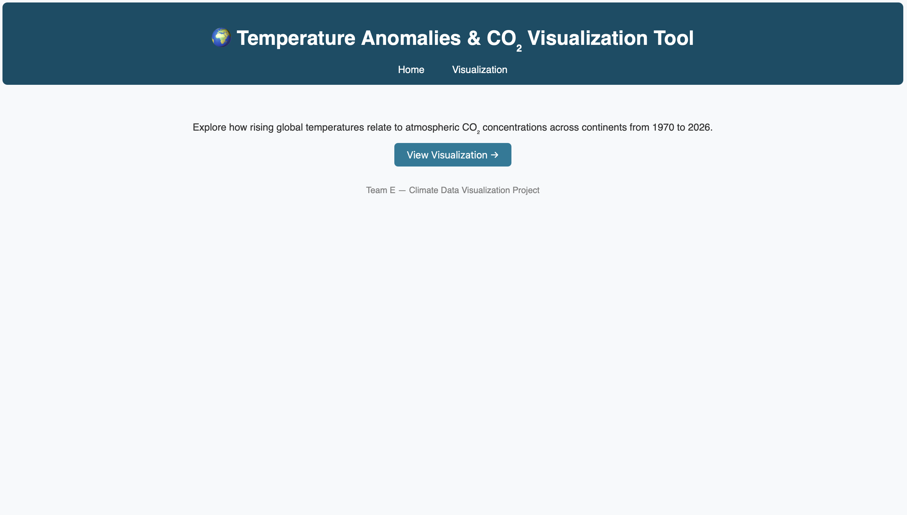
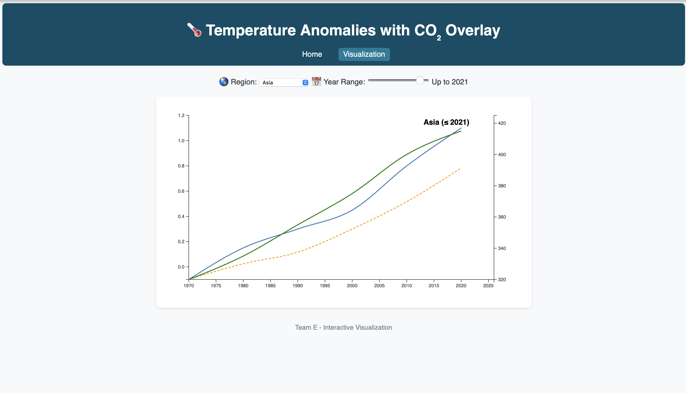

# 🌍 Climate Data Visualization Tool

This project is an **interactive Flask-based visualization tool** designed to explore the relationship between **global temperature anomalies** and **CO₂ concentration** across different continents over time.

It provides an intuitive, web-based interface with D3.js charts, allowing users to visualize trends, apply filters, and understand the impact of greenhouse gases on temperature rise.

---

## 🚀 Features

- Interactive **time-series visualization** using D3.js
- Dual-axis chart showing **temperature anomalies** and **CO₂ overlay**
- **Rolling mean** trend line for temperature smoothing
- **Continent selector** (Global, Asia, Europe, etc.)
- **Year range slider** (1970–2026)
- Flask backend serving static data for demonstration
- Responsive and clean UI with consistent navigation

---

## 🧩 Technology Stack

| Component  | Technology |
|-------------|-------------|
| Backend     | Python Flask |
| Frontend    | HTML, CSS, D3.js |
| Data Source | Static JSON (demo) |
| Visualization | Line and overlay charts |
| Styling     | Custom CSS (no frameworks) |

---

## 📁 Project Structure

```
temperature_anomalies/
│
├── app.py
├── static/
│   ├── css/styles.css
│   ├── js/main.js
│   └── data/static_data.json
│
├── templates/
│   ├── index.html
│   └── visualization.html
│
└── README.md
```

---

## ⚙️ Setup & Run

### 1. Clone the repository
```bash
git clone https://github.com/your-username/climate-visualization.git
cd climate-visualization
```

### 2. (Optional) Create a virtual environment
```bash
python -m venv venv
source venv/bin/activate   # On Windows use: venv\Scripts\activate
```

### 3. Install Flask
```bash
pip install flask
```

### 4. Run the app
```bash
python app.py
```

### 5. Open in browser
Visit **http://127.0.0.1:5000/**

---

## 📊 Visualization Overview

- **Blue line** → Temperature anomaly (°C)
- **Orange dashed line** → Rolling mean of temperature anomaly
- **Green line** → CO₂ concentration (ppm)

Use the dropdown to select a continent and the slider to adjust the year range.

---

## 🖼️ Screenshots

| Home Page | Visualization Page |
|------------|--------------------|
|  |  |

---

## 🧠 Future Enhancements

- Integrate real datasets (NOAA, NASA GISTEMP, EM-DAT)
- Add user-uploaded data support
- Enable CSV/PNG export of charts
- Add interactive heatmaps and forecast options

---

## 🧑‍💻 Authors

- Ahmad Alomari  
- Deepak Singla  
- Naga Venkata Ramkiran Hota  

---

## 📜 License

This project is licensed under the MIT License — see the [LICENSE](LICENSE) file for details.
